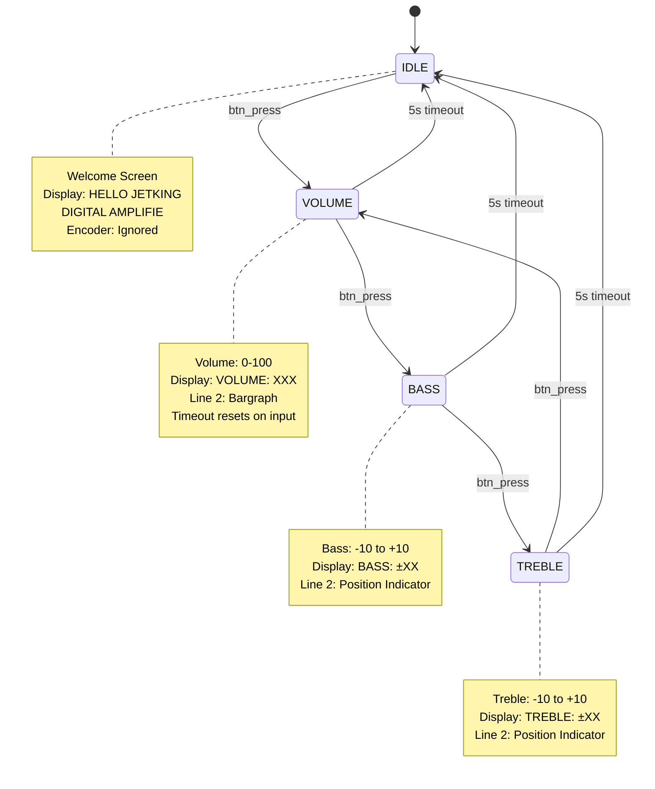

# Digital Amplifier Controller (FPGA)

A complete FPGA-based digital amplifier controller with a rotary encoder interface and I2C LCD display, implemented in Verilog for Xilinx FPGAs using Vivado.


## Table of Contents

- [Overview](#overview)
- [Demo](#demo)
- [Features](#features)
- [Hardware Requirements](#hardware-requirements)
- [System Architecture](#system-architecture)
- [RTL Module Documentation](#rtl-module-documentation)
- [User Interface Behavior](#user-interface-behavior)
- [Building the Project](#building-the-project)
- [Simulation and Testing](#simulation-and-testing)
- [Pin Assignments](#pin-assignments)
- [Timing Specifications](#timing-specifications)
- [Troubleshooting](#troubleshooting)
- [Repository Structure](#repository-structure)

---

## Overview

This project implements a user interface for a digital audio amplifier controller. The design allows users to adjust Volume, Bass, and Treble settings using a rotary encoder with a push button. Real-time feedback is displayed on a 16×2 character LCD connected via I2C (PCF8574 backpack).

The system features a clean finite state machine (FSM) design with automatic timeout for returning to the idle screen, debounced encoder inputs, and a robust LCD command sequencer that handles all timing and handshaking.

---

## Demo

Watch the digital amplifier controller in action:

[](https://youtu.be/9exR9p0qSzM)

*Click the image above to watch the video demonstration showing menu navigation, volume adjustment with bargraph display, and bass/treble controls with position indicators.*

---

## Features

- **Rotary Encoder Input**
  - Quadrature decoder with built-in debouncing
  - Detects clockwise/counter-clockwise rotation
  - Integrated push-button for menu navigation

- **Visual Feedback**
  - 16×2 HD44780-compatible LCD (I2C interface via PCF8574)
  - Dynamic bargraph visualization for Volume (0–100)
  - Position indicator with center marker for Bass/Treble (−10 to +10)
  - Automatic screen updates on parameter changes

- **User Interface**
  - 4-state FSM: IDLE, MENU_VOLUME, MENU_BASS, MENU_TREBLE
  - 5-second automatic timeout to IDLE state
  - Cycle through menus via button press
  - Adjust values via rotary encoder (only in menu states)

- **Audio Parameter Control**
  - Volume: 0–100 (7-bit output)
  - Bass: −10 to +10 (5-bit signed output)
  - Treble: −10 to +10 (5-bit signed output)

---

## Hardware Requirements

### FPGA Board
- Xilinx FPGA (tested with Zynq UltraScale+ / 7-series)
- Minimum resources: ~500 LUTs, ~300 FFs
- Clock: 100 MHz main clock (generates 1 MHz for LCD internally)

### External Components
- **Rotary Encoder**: Standard quadrature encoder with integrated push button
  - 2 signal pins (A, B) + button
  - Pull-up resistors recommended (internal or external)

- **LCD Display**: 16×2 HD44780-compatible character LCD
  - PCF8574 I2C backpack module (default address: 0x27)
  - I2C interface: SDA, SCL (pull-ups required, typically 4.7kΩ)
  - 5V or 3.3V compatible (check backpack specs)

- **Power Supply**: 3.3V or 5V depending on FPGA and LCD requirements

---

## System Architecture

```
┌─────────────────────────────────────────────────────────────┐
│                     Top Module (top.v)                      │
├─────────────────────────────────────────────────────────────┤
│                                                             │
│  ┌──────────────────┐        ┌─────────────────────────┐   │
│  │ Rotary Decoder   │──inc──>│                         │   │
│  │                  │──dec──>│  Amplifier Controller   │   │
│  │ (quadrature +    │──btn──>│       FSM               │   │
│  │  debouncing)     │        │                         │   │
│  └──────────────────┘        │  • Menu state machine   │   │
│         ^  ^  ^              │  • Parameter storage    │   │
│         │  │  │              │  • Display sequencer    │   │
│      enc_a │  btn            │  • Timeout logic        │   │
│         enc_b                └──────────┬──────────────┘   │
│                                         │ cmd interface    │
│                              ┌──────────▼──────────────┐   │
│                              │ PCF8574 LCD Controller  │   │
│                              │                         │   │
│                              │ • 4-bit HD44780 logic   │   │
│                              │ • Init sequence         │   │
│                              │ • Command parser        │   │
│                              └──────────┬──────────────┘   │
│                                         │ i2c interface    │
│                              ┌──────────▼──────────────┐   │
│                              │  I2C Master Writer      │   │
│                              │                         │   │
│                              │ • Bit-bang I2C          │   │
│                              │ • Address + Data write  │   │
│                              └──────────┬──────────────┘   │
│                                         │                  │
│                                      SDA│SCL               │
└─────────────────────────────────────────┼──────────────────┘
                                          │
                                    ┌─────▼──────┐
                                    │  PCF8574   │
                                    │  I2C-to-   │
                                    │  Parallel  │
                                    └─────┬──────┘
                                          │ 4-bit parallel
                                    ┌─────▼──────┐
                                    │ HD44780    │
                                    │ 16×2 LCD   │
                                    └────────────┘
```

---

## RTL Module Documentation


### Main Controller FSM State Diagram




### 1. `ampli_controller_fsm.v`

**Purpose**: Main controller FSM managing menu navigation, parameter updates, and LCD display updates.

**Parameters**:
- `CLK_FREQ`: System clock frequency (default: 100 MHz)
- `TIMEOUT_SEC`: Auto-return to IDLE timeout (default: 5 seconds)

**Key Interfaces**:
- Rotary encoder inputs: `enc_inc`, `enc_dec`, `btn_press`
- LCD controller: `lcd_cmd_valid`, `lcd_cmd_type[2:0]`, `lcd_cmd_data[7:0]`, `lcd_ready`, `lcd_init_done`
- Audio parameter outputs: `volume[6:0]`, `bass[4:0]`, `treble[4:0]`

**FSM States**:
- `STATE_IDLE`: Welcome screen, encoder ignored
- `STATE_MENU_VOLUME`: Adjust volume (0–100)
- `STATE_MENU_BASS`: Adjust bass (−10 to +10)
- `STATE_MENU_TREBLE`: Adjust treble (−10 to +10)

**Display Update Logic**:
- Generates `line1_buffer[127:0]` and `line2_buffer[127:0]` (16 ASCII characters each)
- Sequences LCD commands: CLEAR → SET_CURSOR(0x00) → WRITE_DATA×16 → SET_CURSOR(0x40) → WRITE_DATA×16
- Handshake with LCD controller via ready/valid protocol

---

### 2. `pcf8574_lcd_controller.v`

**Purpose**: HD44780 LCD controller using 4-bit mode via PCF8574 I2C expander.

**Parameters**:
- `PCF8574_ADDR`: I2C slave address (default: 7'h27)

**Clock**: Expects 1 MHz clock input

**Command Types**:
- `CMD_INIT (0)`: Initialization sequence (auto-run on reset)
- `CMD_CLEAR (1)`: Clear display
- `CMD_WRITE_CMD (2)`: Send raw LCD command byte
- `CMD_WRITE_DATA (3)`: Write character data
- `CMD_SET_CURSOR (4)`: Set DDRAM address (cursor position)

**Initialization Sequence**:
1. 15ms power-on delay
2. Set 4-bit mode
3. Function set (4-bit, 2 lines, 5×8 font)
4. Display ON (cursor off)
5. Entry mode (auto-increment)
6. Clear display (2ms delay)

**PCF8574 Byte Format**: `{D7, D6, D5, D4, BL, EN, RW, RS}`
- `D7–D4`: Data nibble
- `BL`: Backlight (always 1)
- `EN`: Enable strobe
- `RW`: Read/Write (always 0)
- `RS`: Register Select (0=command, 1=data)

---

### 3. `i2c_master_writer.v`

**Purpose**: Bit-banged I2C master for writing single bytes to a slave device.

**Clock**: 1 MHz (generates ~100 kHz I2C SCL)

**Operation**:
- Pulse `start` high to initiate transfer
- Provides 7-bit `slave_addr` and 8-bit `data_byte`
- Asserts `busy` during transaction
- Pulses `done` for 1 cycle when complete

**I2C Sequence**: START → Address+W → ACK → Data → ACK → STOP

**Timing**: Each bit takes ~11 clock cycles, total transaction ~200 cycles (~200 µs @ 1 MHz)

---

### 4. `rotary_decoder.v`

**Purpose**: Quadrature decoder with synchronization and debouncing.

**Parameters**:
- `DEBOUNCE_TIME`: Debounce cycles (default: 1000 @ 100 MHz = 10 µs)

**Outputs**:
- `inc_pulse`: Single-cycle pulse on clockwise rotation
- `dec_pulse`: Single-cycle pulse on counter-clockwise rotation

**Algorithm**:
- 2-stage FF synchronizer for metastability protection
- Counter-based debouncing (settles after stable input for `DEBOUNCE_TIME` cycles)
- Quadrature decode: CW when A leads B, CCW when B leads A

---

### 5. `button_debounce.v`

**Purpose**: Debounces the rotary encoder push button.

**Parameters**:
- `DEBOUNCE_TIME`: Debounce cycles (default: 1,000,000 @ 100 MHz = 10 ms)

**Output**:
- `btn_press`: Single-cycle pulse on button press (rising edge after debounce)

---

## User Interface Behavior

### IDLE State
- **Line 1**: `"HELLO JETKING   "`
- **Line 2**: `"DIGITAL AMPLIFIE"`
- Encoder rotation is ignored
- Press button → transition to `MENU_VOLUME`
- No timeout (stays in IDLE indefinitely)

### MENU_VOLUME
- **Line 1**: `"VOLUME: 050     "` (displays current volume 000–100)
- **Line 2**: 16-character bargraph
  - Empty cells: `-` (0x2D)
  - Filled cells: `█` (0xFF, full block)
  - Example at 50%: `████████--------`
- Rotate encoder to adjust volume (0–100)
- Press button → transition to `MENU_BASS`
- 5-second timeout → return to IDLE

### MENU_BASS
- **Line 1**: `"BASS: +05       "` (displays current bass −10 to +10)
- **Line 2**: 16-character position indicator
  - Background: `-` (0x2D)
  - Center marker: `|` (0x7C) at position 7
  - Current position: `*` (0x2A)
  - Value 0 → `*` at index 7
  - Negative values → `*` left of center (indices 0–6)
  - Positive values → `*` right of center (indices 8–15)
  - Example at bass=0: `-------*--------`
  - Example at bass=+5: `-------|-*------`
  - Example at bass=−7: `--*-----|--------`
- Rotate encoder to adjust bass (−10 to +10)
- Press button → transition to `MENU_TREBLE`
- 5-second timeout → return to IDLE

### MENU_TREBLE
- **Line 1**: `"TREBLE: +05     "` (displays current treble −10 to +10)
- **Line 2**: Same position indicator as BASS
- Rotate encoder to adjust treble (−10 to +10)
- Press button → transition to `MENU_VOLUME` (wraps around)
- 5-second timeout → return to IDLE

### Timeout Behavior
- Timeout counter resets on any user input (button press or encoder rotation)
- After 5 seconds of inactivity in any menu state, automatically returns to IDLE
- Display updates once when transitioning to IDLE

---

## Building the Project

### Prerequisites
- Vivado v2025.1 or later recommended
- Target FPGA: Zynq UltraScale+ or 7-series

## Simulation and Testing

### Testbench Overview

Two self-checking testbenches are provided in `rtl/tb/`:

#### 1. `tb_rotary_decoder.v`

**Purpose**: Validates the rotary encoder quadrature decoder.

**Test Coverage**:
- Clockwise rotation sequence (00 → 10 → 11 → 01 → 00)
- Counter-clockwise rotation sequence (00 → 01 → 11 → 10 → 00)
- Verifies correct pulse generation (`inc_pulse` or `dec_pulse`)
- Checks that opposite-direction pulses are not generated

**Configuration**:
- Clock: 100 MHz (10 ns period)
- Debounce: Reduced to 3 cycles for fast simulation
- Total runtime: ~2 µs

**Expected Output**: Prints `"tb_rotary_decoder: PASS"` and calls `$finish`.

---

#### 2. `tb_pcf8574_lcd_controller.v`

**Purpose**: Validates the LCD controller's command interface and sequencing.

**Test Coverage**:
- Wait for initialization completion (`init_done`)
- Send CLEAR command
- Set cursor to line 2 (address 0x40)
- Write character data ('A', 'B')
- Send raw LCD command (Display ON)
- Verify `cmd_ready` handshake for all commands

**Fake I2C Model**:
- Simulates I2C completion: `i2c_start` → `i2c_busy` (3 cycles) → `i2c_done` (1 cycle pulse)
- Accelerates simulation by avoiding real I2C timing

**Configuration**:
- Clock: 10 MHz (100 ns period) — faster than real 1 MHz to reduce sim time
- Controller delays scaled accordingly (e.g., 15 ms init → 1.5 ms in sim)
- Total runtime: ~1.7–1.8 ms

**Expected Output**: Prints `"tb_pcf8574_lcd_controller: PASS"` and calls `$finish`.

---

### Running Testbenches in Vivado

**Method 1: Vivado GUI**
1. In Vivado, add testbench files to Simulation Sources:
   - Right-click "Simulation Sources" → Add Sources → Add Files
   - Select `rtl/tb/tb_rotary_decoder.v` and/or `rtl/tb/tb_pcf8574_lcd_controller.v`
2. Set simulation top module:
   - Right-click testbench → Set as Top
3. Run Simulation:
   - Flow → Run Simulation → Run Behavioral Simulation
4. Check TCL Console for `PASS` message

**Method 2: TCL Commands**
```tcl
# For rotary decoder test
set_property top tb_rotary_decoder [get_filesets sim_1]
launch_simulation
run all

# For LCD controller test
set_property top tb_pcf8574_lcd_controller [get_filesets sim_1]
launch_simulation
run all
```

**Viewing Waveforms** (optional):
- Add signals to waveform window before `run all`
- Observe FSM state transitions, handshake signals, etc.

---

## Pin Assignments


**Note**: Pin assignments depend on your specific FPGA board. Below is an example template.

### Example Constraints (XDC format)

```tcl
#set_property CLOCK_DEDICATED_ROUTE FALSE [get_nets reset_N]

set_property IOSTANDARD LVCMOS18 [get_ports rst_n_0]
set_property IOSTANDARD LVCMOS18 [get_ports i2c_sda_0]
set_property IOSTANDARD LVCMOS18 [get_ports i2c_scl_0]
set_property IOSTANDARD LVCMOS18 [get_ports enc_sw_0]
set_property IOSTANDARD LVCMOS18 [get_ports enc_b_0]
set_property IOSTANDARD LVCMOS18 [get_ports enc_a_0]
set_property IOSTANDARD LVCMOS18 [get_ports debug_timeout_0]
set_property IOSTANDARD LVCMOS18 [get_ports {debug_state_0[1]}]
set_property IOSTANDARD LVCMOS18 [get_ports {debug_state_0[2]}]
set_property IOSTANDARD LVCMOS18 [get_ports {debug_state_0[0]}]
set_property PACKAGE_PIN E5 [get_ports enc_a_0]
set_property PULLTYPE PULLUP [get_ports enc_a_0]
set_property PACKAGE_PIN E6 [get_ports enc_b_0]
set_property PULLTYPE PULLUP [get_ports enc_b_0]
set_property PACKAGE_PIN F6 [get_ports enc_sw_0]
set_property PULLTYPE PULLUP [get_ports enc_sw_0]
set_property PACKAGE_PIN F7 [get_ports i2c_sda_0]
set_property PULLTYPE PULLUP [get_ports i2c_sda_0]
set_property PACKAGE_PIN F8 [get_ports i2c_scl_0]
set_property PULLTYPE PULLUP [get_ports i2c_scl_0]
set_property PACKAGE_PIN A8 [get_ports rst_n_0]
set_property PULLTYPE PULLUP [get_ports rst_n_0]
set_property PACKAGE_PIN F4 [get_ports {debug_state_0[2]}]
set_property PACKAGE_PIN A2 [get_ports {debug_state_0[1]}]
set_property PACKAGE_PIN B4 [get_ports {debug_state_0[0]}]
set_property PACKAGE_PIN G7 [get_ports debug_timeout_0]
```

**Modify these** to match your board's schematic and I/O voltage standards.

---

## Timing Specifications

### Clock Domains

| Clock | Frequency | Purpose |
|-------|-----------|---------|
| System Clock | 100 MHz | Main FSM, rotary decoder, button debouncing |
| LCD Clock | 1 MHz | LCD controller, I2C master (derived from system clock) |

**Note**: Ensure proper clock domain crossing if using separate clock sources. Current design assumes single 100 MHz input with clock divider for LCD.

### Critical Timing Paths

- **Rotary Decoder**: Debounce counters (16-bit) — typically meets timing easily
- **FSM**: State transitions and timeout counter (32-bit) — review timing reports
- **LCD Sequencer**: Display state machine and character indexing — low frequency, timing slack expected

### I2C Timing

- SCL frequency: ~100 kHz (generated from 1 MHz clock, ~11 cycles per bit)
- Meets standard I2C timing requirements for PCF8574

---

## Troubleshooting

### LCD shows garbage characters or nothing

**Possible Causes**:
1. **I2C address mismatch**: Check your PCF8574 address (common: 0x27, 0x3F). Modify `PCF8574_ADDR` parameter in `pcf8574_lcd_controller.v`.
2. **Clock frequency**: Verify LCD controller receives 1 MHz clock. Check clock divider logic in top module.
3. **Wiring**: Verify SDA/SCL connections and pull-up resistors (typically 4.7kΩ).
4. **Power**: Ensure LCD backpack has adequate 5V supply (some need separate power).
5. **Initialization timing**: LCD needs 15ms after power-on before initialization. Ensure FPGA reset/startup timing allows this.

**Debug Steps**:
- Use ILA (Integrated Logic Analyzer) to capture I2C transactions
- Check `lcd_init_done` signal — should go high after ~17ms
- Monitor `i2c_sda` and `i2c_scl` with oscilloscope/logic analyzer

---

### Rotary encoder not responding

**Possible Causes**:
1. **Pull-up resistors**: Encoder outputs may need external pull-ups (10kΩ recommended).
2. **Debounce time**: If encoder has excessive noise, increase `DEBOUNCE_TIME` parameter.
3. **Wiring**: Verify A/B signal connections, check for shorts.
4. **Direction reversed**: Swap `enc_a` and `enc_b` pins if rotation direction is inverted.

**Debug Steps**:
- Use ILA to observe raw encoder signals and `enc_a_stable`, `enc_b_stable`
- Check `inc_pulse` and `dec_pulse` generation in simulation

---

### Timeout not working

**Possible Causes**:
1. **Clock frequency mismatch**: `TIMEOUT_CYCLES` calculation assumes 100 MHz. Verify `CLK_FREQ` parameter matches actual clock.
2. **Counter overflow**: Ensure `timeout_cnt[31:0]` width is sufficient.

**Debug Steps**:
- Monitor `timeout_cnt` value and `timeout_flag` output
- Adjust `TIMEOUT_SEC` parameter for testing (e.g., reduce to 2 seconds)

---

### Strange display artifacts on line 2

**Possible Causes**:
1. **Command timing**: Ensure LCD controller has enough delay between commands (50 µs default).
2. **Cursor positioning**: Verify `CMD_SET_CURSOR` with data `0x40` is sent before line 2 writes.

**Fix Applied**: The `ampli_controller_fsm` now uses a robust handshake that holds `lcd_cmd_valid` high until `lcd_ready` deasserts, preventing missed commands.

---

## Repository Structure

```
amplifier/
├── amplifier.xpr                  # Vivado project file
├── README.md                      # This file
├── FIXES_APPLIED.md              # Development log
├── QUICK_FIX.md                  # Quick reference
│
├── rtl/                          # RTL source files
│   ├── ampli_controller_fsm.v    # Main controller FSM
│   ├── pcf8574_lcd_controller.v  # LCD controller (4-bit via PCF8574)
│   ├── i2c_master_writer.v       # I2C bit-bang master
│   ├── rotary_decoder.v          # Quadrature decoder with debouncing
│   ├── button_debounce.v         # Button debouncer
│   ├── top.v                     # Top-level wrapper (if exists)
│   ├── README.md                 # RTL-specific notes
│   ├── QUICKSTART.md             # Quick start guide
│   │
│   ├── tb/                       # Testbenches
│   │   ├── tb_rotary_decoder.v
│   │   └── tb_pcf8574_lcd_controller.v
│   │
│   └── cnstr/                    # Constraints (if separate)
│
├── amplifier.srcs/               # Vivado-managed sources
│   ├── sources_1/                # Design sources
│   ├── constrs_1/                # Constraint files (XDC)
│   └── utils_1/                  # Utilities
│
├── amplifier.runs/               # Build outputs
│   ├── synth_1/                  # Synthesis outputs
│   └── impl_1/                   # Implementation outputs
│       └── design_3_wrapper.bit  # Final bitstream
│
├── amplifier.sim/                # Simulation outputs
│   └── sim_1/behav/              # Behavioral simulation
│
├── docs/                         # Documentation
└── temp/                         # Temporary/reference files
```

---

**Author**: Tam.Nguyen @2025

---

## Additional Resources

- [HD44780 LCD Controller Datasheet](https://www.sparkfun.com/datasheets/LCD/HD44780.pdf)
- [PCF8574 I2C I/O Expander Datasheet](https://www.nxp.com/docs/en/data-sheet/PCF8574_PCF8574A.pdf)
- [Rotary Encoder Interface Guide](https://www.best-microcontroller-projects.com/rotary-encoder.html)
- Xilinx Vivado Documentation: [UG893 - Using Vivado Design Suite](https://www.xilinx.com/support/documentation/sw_manuals/xilinx2020_2/ug893-vivado-ide.pdf)
